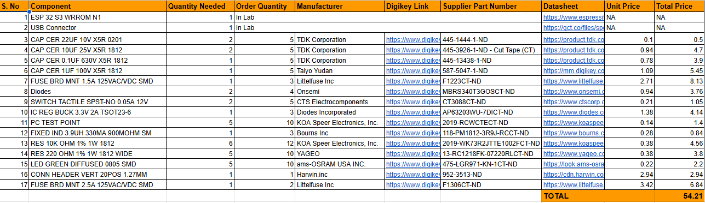

# Bill of Materials (BOM)

This document lists the components required for the project. The full list, including part numbers, suppliers, and additional details, can be found in the linked file below.

## **BOM Overview**

The following components are essential for the successful completion of the project. The BOM includes the part numbers, quantities, descriptions, and any additional notes relevant to sourcing and procurement.

> **Note:** Some components are available in stock at Peralta 109 and do not need to be ordered.

## **Download Full BOM Google Sheet**
[📎 BOM (G-Sheet)](https://docs.google.com/spreadsheets/d/1Lty8mTdRefT_vAFwkvvfCRsP3DJ18b6C/edit?usp=sharing&ouid=101291518142862283716&rtpof=true&sd=true)
[📎 Purchase Request (G-Sheet)](https://docs.google.com/spreadsheets/d/1erS42jfHQJueBSrKlp_hZEIR4DH4sWFf/edit?usp=sharing&ouid=101291518142862283716&rtpof=true&sd=true)

## Conclusion
This BOM ensures that all necessary components are accounted for and easily accessible, allowing for smooth project execution and debugging.

