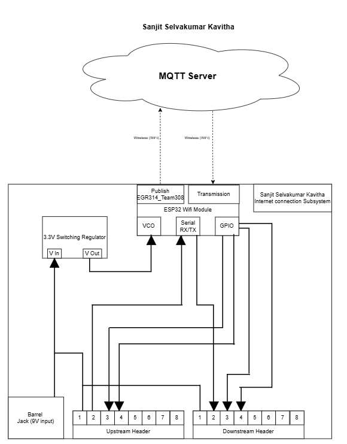

# Embedded Systems Block Diagram
**Author:** Sanjit Selvakumar Kavitha

## Overview  
This page presents the block diagram for the Wi-Fi/Internet Communication Subsystem, featuring debugging LEDs for the MQTT server, RX and TX indicators, a voltage regulator, and upstream/downstream connectors. The entire subsystem is managed by the ESP32-S3-WROOM-N4.

## Block Diagram Preview  

## Download the Block Diagram  
[Draw.io Block Digram View](https://drive.google.com/file/d/1Zu_ZALLJ08QVjuWkUUsSZqnZJdQ2op89/view?usp=sharing)
[Block Diagram PDF Dwonload](https://drive.google.com/file/d/1SzkVRQ6n4QjP0WH3-RH0_l-9RIu3c7Me/view?usp=sharing)
