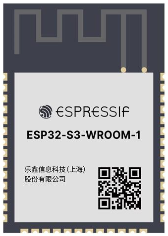
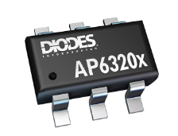

# Wi-Fi-Enabled Data Collection and Transmission Subsystem

## **Overview**

In this embedded systems design project, we focus on building a subsystem capable of collecting sensor data, transmitting it over a Wi-Fi network managed by the ESP32 microcontroller, and updating a real-time webpage hosted on GitHub. This document provides both the **original component selection rationale** and the **updated final summary**, including new components, an expanded pinout, and a decision-making discussion.

---

## **Original Component Selection**

### **Microcontroller**

For the heart of our subsystem, we chose the **ESP32-S3-WROOM-1-N4**. Its built-in Wi-Fi connectivity, processing capabilities, and flexibility make it ideal for sensor data acquisition and transmission.

| **Option**               | **Advantages**                                                | **Disadvantages**                                     | **Cost & Link**                                                                      |
|--------------------------|---------------------------------------------------------------|------------------------------------------------------|--------------------------------------------------------------------------------------|
| **ESP32-S3-WROOM-1-N4**  | Built-in Wi-Fi/Bluetooth, supports I2C/SPI/UART, low power modes, 4MB Flash | 3.3V logic may require level shifters for certain peripherals | [$2.95 DigiKey](https://www.digikey.com/en/products/detail/espressif-systems/ESP32-S3-WROOM-1-N4/16162639) |
| ESP8266                  | Affordable, simple to use                                     | Limited GPIO pins, lacks dual-core processor         | [$1.60 DigiKey](https://www.digikey.com/en/products/detail/espressif-systems/ESP8266EX/8028401) |
| Raspberry Pi Pico W      | Dual-core, built-in Wi-Fi                                    | Higher power usage, larger physical size             | [$6.00 DigiKey](https://www.digikey.com/en/products/detail/raspberry-pi/SC0918/16627943) |

**Choice:**  
We selected the **ESP32-S3-WROOM-1-N4** due to its superior Wi-Fi capabilities, dual-core processor for multitasking, and compatibility with sensor interfaces like I2C and SPI.

### **Power Regulation**

To ensure stable operation of the ESP32 and connected sensors, we require a voltage regulator that steps down the input voltage to a steady 3.3V.

| **Option**           | **Advantages**                                       | **Disadvantages**                        | **Cost & Link**                                                                  |
|----------------------|------------------------------------------------------|----------------------------------------|----------------------------------------------------------------------------------|
| **AP63203WU-7**      | Simple design, low cost                              | Low efficiency                         | [$1.38 DigiKey](https://www.diodes.com/assets/Datasheets/AP63200-AP63201-AP63203-AP63205.pdf) |
| LM2596               | High efficiency, more robust                        | Larger size                            | [$6.70 DigiKey](https://www.digikey.com/en/products/detail/texas-instruments/LM2596S-ADJ-NOPB/363705) |
| HT7333               | Ultra-low quiescent current                          | Limited current output                 | [$2.65 DigiKey](https://www.digikey.com/en/products/detail/umw/HT7333-A/17635230) |

**Choice:**  
The **AP63203WU-7** was chosen for simplicity, affordability, and SMD compatibility.

### **Power Input**

To provide consistent power for the ESP32 and sensors, we selected a **DC Barrel Jack Adapter** for reliable external power.

### **Additional Recommended Components**

1. **Boot and Enable Buttons**  
2. **Decoupling Capacitors (10µF, 0.1µF)**  
3. **LED Indicators**  

---

## **Updated Final Component Selection**

| **Component**           | **Role**                                      | **Key Specifications**                    | **Justification**                                             |
|-------------------------|-----------------------------------------------|--------------------------------------------|--------------------------------------------------------------|
| **ESP32-S3-WROOM-1-N4** | Microcontroller & Wi-Fi module                | Dual-core Xtensa MCU, 4 MB Flash, 3.3 V    | Native Wi-Fi/MQTT support, low-power modes, ample I/O        |
| **AP63203WU-7**         | 3.3 V Voltage Regulator                       | 600 mA output, SOT-23 package, low noise   | Stable 3.3 V, small footprint, cost-effective               |

> *Passive components, pushbuttons, and indicators are documented elsewhere.*

---

## **Updated Pinout Configuration**

| **Function**            | **ESP32 Pin**  | **Peripheral / Signal** | **Notes**                                     |
|-------------------------|---------------|-------------------------|-----------------------------------------------|
| Power Supply Input      | VIN           | DC Barrel Jack (5–12 V) | Feeds voltage regulator                       |
| Regulated Output        | 3V3           | 3.3 V rail              | Supplies ESP32 and sensors                     |
| Wi-Fi Antenna           | ANT           | External antenna        | Optional for range enhancement                 |
| UART TX (Debug)         | GPIO17        | UART1 TX                | Serial debug communication                     |
| UART RX (Debug)         | GPIO18        | UART1 RX                | Serial debug communication                     |
| MQTT Task Scheduling    | —             | Firmware logic          | Runs on dual cores                             |

---

## **Decision-Making Process**

1. **Core Requirements**  
   - Reliable Wi-Fi & MQTT support  
   - Sufficient processing headroom  
   - Low-power operation on 3.3 V  

2. **Evaluation**  
   - **ESP32-S3**: Chosen for integrated Wi-Fi, dual cores, OTA support, and low-power modes.  
   - **AP63203WU-7**: Chosen for clean 3.3 V, up to 600 mA, compact SOT-23 package.  

3. **Requirements Alignment**  
   - **Reliability**: Proven components with wide community support.  
   - **Scalability**: Extra I/O and integrated wireless allow future expansion.  
   - **Maintainability**: Standard interfaces and libraries simplify firmware updates.  

4. **Feedback Addressed**  
   - Added decoupling capacitors for power stability.  
   - Remapped debug UART to free primary pins.

---

## **Conclusion**

By retaining the original rationale and integrating the updated summary, pinout, and decision-making insights, this document now fully reflects both the initial component evaluation and the final selections that satisfy the subsystem requirements.

