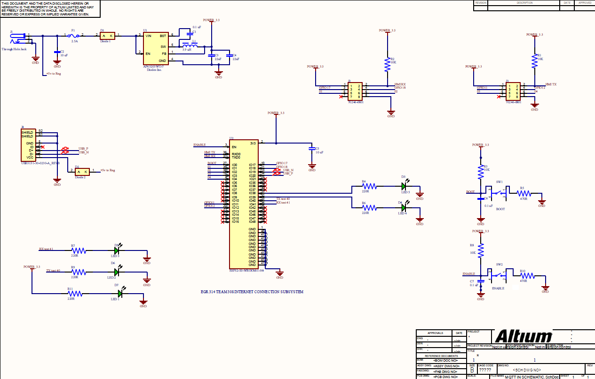
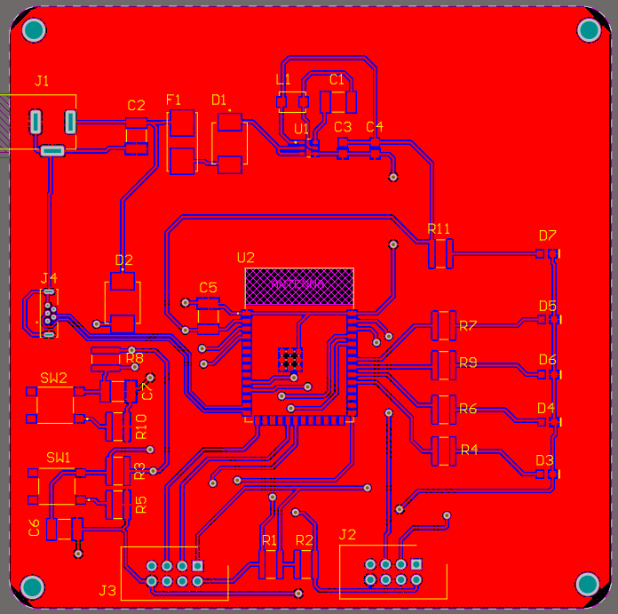

# 1. Schematic
This schematic outlines the design of a subsystem centered around the ESP32-S3-WROOM-1-N4 microcontroller, which is responsible for communication with the MQTT server and integration into a daisy chain system. The design includes a switching voltage regulator that provides a stable 3.3V output to the ESP32, UART communication lines for bidirectional data exchange, and essential debugging components such as status LEDs and buttons for enabling boot and reset modes. The system’s connectivity is designed to ensure seamless integration with other boards in the daisy chain while enabling efficient communication with the MQTT server. Each component is chosen to meet the specific requirements for robust embedded system design, ensuring reliable operation across multiple interconnected devices.

## Schematic Diagram
Here is the Schematic for Internet Communication Subsystem:

## Schematic Files

### 📄 PDF Version  
[📎 View Schematic (PDF)](./subfolder/schematicpdf.pdf)

## 2. Updated PCB Images

Below are high-resolution photographs of our final fabricated PCB, showcasing both the front and back views.

### Front View

*Figure 2.1: Front side of the PCB, showing component placement, silkscreen labels, and indicator LEDs.*

### Back View

*Figure 2.2: Back side of the PCB, highlighting the ground pour, power rails, and via stitching.*

# 3. Gerber Files Archive

All Gerber outputs for fabrication:

[⬇️ Download Gerber Files (ZIP)](./subfolder/gerber.zip)

---

# 4. Functionality Discussion

Our PCB implements the **MQTT & Processing Subsystem**, which must:

1. **Regulate Power Autonomously**  
   Use a 5 V → 3.3 V buck converter to maintain a stable rail under varying input voltages.  
2. **Collect & Relay Sensor Data**  
   Act as the terminal node in a UART daisy-chain, forwarding soil moisture, temperature/humidity, and pump-status messages.  
3. **Enable Wi-Fi & MQTT Connectivity**  
   Leverage the ESP32-S3 module to publish telemetry and subscribe to control commands.  
4. **Control Downstream Actuators**  
   Issue back-to-back UART commands to the motor subsystem based on temperature thresholds.  
5. **Support Debugging**  
   Provide TX/RX LEDs and a dedicated UART header for in-field diagnostics.

By cross-referencing our pinout, power-budget analysis, and layout checks, we ensure the design meets requirements for reliability, low power consumption, and seamless subsystem integration.

---

# 5. Design & Decision-Making Process

- **Component Selection**  
  - **ESP32-S3**: Chosen for its integrated Wi-Fi/Bluetooth, dual-core performance, and low-power sleep modes.  
  - **AP63203WU-7**: Selected for its ~85 % efficiency, compact SOT-23 footprint, and capacity to handle our ~0.6 W load.

- **Schematic & Layout**  
  - Placed decoupling capacitors within 2 mm of the ESP32 and regulator to minimize supply noise.  
  - Implemented a continuous ground pour and widened power traces to lower impedance and improve stability.

- **Pin Labeling & Interfaces**  
  - Revised silkscreen to label all GPIO, power rails, and connectors, addressing earlier feedback.  
  - Aligned UART headers for straightforward daisy-chain wiring; positioned the Wi-Fi antenna connector at the board edge for optimal clearance.

- **Prototyping & Testing**  
  - Verified UART frame handling and MQTT publish/subscribe on a hand-wired test jig.  
  - Conducted thermal profiling under worst-case load; added copper pours as a heatsink for the buck converter.

- **Iteration & Refinement**  
  - Relocated Schottky diodes closer to the input path and increased copper weight on the 5 V rail after initial spin.  
  - Completed DFM checks, added fiducials for assembly, and finalized panelization.

This end-to-end process—from requirements capture and prototyping through layout refinement and fabrication—ensures our PCB reliably supports the smart irrigation system’s functional, electrical, and operational needs.  

