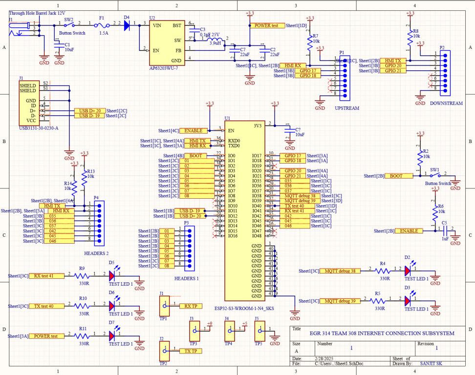

# Schematic & Power Budget
This schematic outlines the design of a subsystem centered around the ESP32-S3-WROOM-1-N4 microcontroller, which is responsible for communication with the MQTT server and integration into a daisy chain system. The design includes a switching voltage regulator that provides a stable 3.3V output to the ESP32, UART communication lines for bidirectional data exchange, and essential debugging components such as status LEDs and buttons for enabling boot and reset modes. The system’s connectivity is designed to ensure seamless integration with other boards in the daisy chain while enabling efficient communication with the MQTT server. Each component is chosen to meet the specific requirements for robust embedded system design, ensuring reliable operation across multiple interconnected devices.

## Schematic Diagram
Here is the Schematic for Internet Communication Subsystem:

## Schematic Files

### 📄 PDF Version  
[📎 View Schematic (PDF)](https://drive.google.com/file/d/13G6R2haFRqhL6EKzLBHhy4ZJv-TCrBA7/view?usp=sharing)

### 🖼️ Image Preview  

### 📁 Source Files (ZIP)  
[📥 Download Schematic Files](https://drive.google.com/file/d/1QpxOKzqbLA2aMnmsmpnBQE0VEMeH1ZOZ/view?usp=sharing)

# Power Budget Calculation

## Power Formula Used
\[
P = V \times I
\]
where:  
- **P** = Power in watts (W)  
- **V** = Voltage in volts (V)  
- **I** = Current in amperes (A)  

---

## Power Budget Table

| **Component**                     | **Quantity** | **Voltage (V)** | **Current (A) per unit** | **Power (W) per unit** | **Total Power (W)** | **Notes** |
|------------------------------------|-------------|----------------|----------------|----------------|----------------|-----------|
| **LEDs (WL-SMCC SMT Mono-color Chip LED)** | 5  | 2V             | 10mA (0.01A)  | `2V × 0.01A = 0.02W`  | `5 × 0.02 = 0.1W` | Assumed 2V, 10mA each |
| **Schottky Diode (SOD-323)**       | 1  | 0.3V drop      | 1A             | `0.3V × 1A = 0.3W` | `0.3W` | Power dissipation |
| **Fuse (2.5A 125VAC/VDC SMD)**     | 1  | -              | -              | `0W` | `0W` | No power unless tripped |
| **ESP32-S3-WROOM-1-N4_SKS**        | 1  | 3.3V           | 150mA (0.15A)  | `3.3V × 0.15A = 0.495W` | `0.5W` | Can peak at ~1W |
| **AP63203WU-7 (Buck Converter)**   | 1  | 3.3V Output    | 2A             | `3.3V × 2A = 6.6W` | `6.6W / 0.85 = 7.8W` | Efficiency ~85%, input power calculated |
| **Resistors (10kΩ)**               | 6  | 3.3V           | `3.3V / 10kΩ = 0.33mA` | `3.3V × 0.00033A = 0.0011W` | `6 × 0.0011 = 0.0066W` | Negligible |
| **Resistors (330Ω)**               | 5  | 3.3V           | `3.3V / 330Ω = 10mA (0.01A)` | `3.3V × 0.01A = 0.033W` | `5 × 0.033 = 0.165W` | Power dissipation |
| **Push Button Switches**           | 2  | -              | -              | `~0W` | `~0W` | Minimal power usage |
| **Micro USB Connector**            | 1  | -              | -              | `0W` | `0W` | No inherent power consumption |
| **Inductor (3.9µH)**               | 1  | -              | -              | `0W` | `0W` | Passive component |

---

## Total Estimated Power Budget
\[
0.1 + 0.3 + 0.5 + 7.8 + 0.0066 + 0.165 = \mathbf{8.87W}
\]
